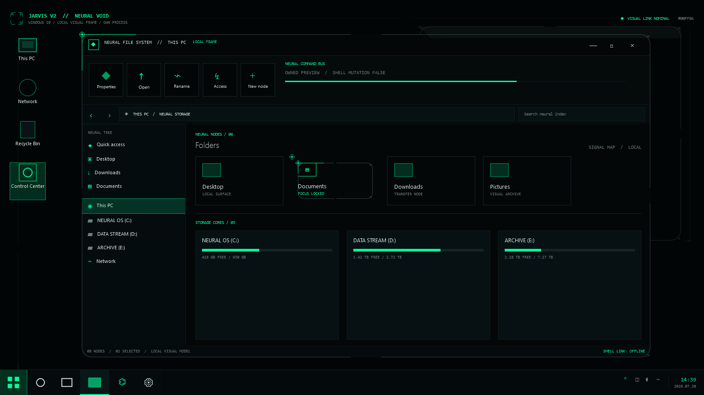

# Windows 10 Neural Void owned preview

`Jarvis.Win10.NeuralVoidPreview` is the first runnable rendering of the
approved D / Neural Void direction. It draws a simulated desktop, Explorer
window and classic Win10 taskbar entirely inside its own WPF process.

The current visual pass treats the reviewed mockups as a style reference
only. It does not copy their forensic workflow, panel layout or decorative
patterns. The retained language is:

- one monochrome accent over neutral black surfaces;
- one-pixel open-corner contours and routed 45-degree joins;
- sparse anchor nodes and low-opacity geometric planes;
- mathematical signal curves instead of bitmap decoration.

`NeuralVectorLayer` records the static frame into one retained
`DrawingVisual`. Its `StreamGeometry` paths are frozen after construction.
RGB frame changes update shared brushes, while only the small signal visual
is redrawn for animation. This keeps the point-line-plane system independent
of the simulated Explorer content and ready to be reused by later Windows 10
surfaces.



The preview covers the eight reviewed roles:

- desktop icon list;
- Explorer command bar, content host and folder view;
- taskbar Start button, task list, notification area and clock.

It does not draw a keyboard, mouse, linked-device panel or RGB device
controller inside the desktop. A/C/D presets and the continuous hue slider
belong to the outer preview host only.

## Interactive preview

```powershell
dotnet .\src\platforms\windows10\Jarvis.Win10.NeuralVoidPreview\bin\Release\net8.0-windows\jarvis-win10-neural-void-preview.dll show
```

The host offers A cyan, C amber and D emerald shortcuts, a 0–360 degree hue
slider and static, breathe, spectrum and signal-pulse effects. Every frame is
computed by the shared `Jarvis.Win10.RgbThemeModel`.

## Deterministic evidence

```powershell
dotnet .\src\platforms\windows10\Jarvis.Win10.NeuralVoidPreview\bin\Release\net8.0-windows\jarvis-win10-neural-void-preview.dll `
  render .\preview.png 156.235294 signal-pulse 0.25
```

The render command creates a 1600x900 PNG and a JSON receipt. The checked-in
screenshot uses D neural emerald at the full-brightness point of the
signal-pulse effect.

## Safety boundary

This is not a desktop replacement and does not inspect or style a real Shell
window. The project has no native imports, process enumeration, registry
access, device I/O or provider SDK. It cannot mutate Explorer or physical
devices, and it cannot activate a module.
