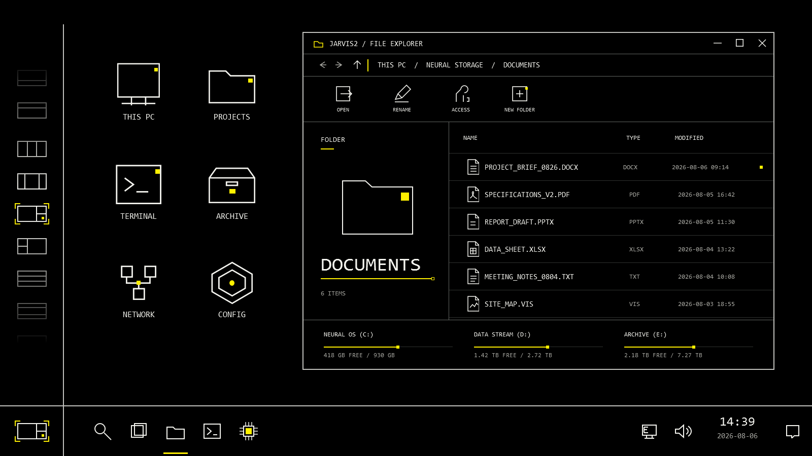

# Windows 10 Horizon Membrane desktop shell owned preview

> Evidence boundary: `Jarvis.Win10.NeuralVoidPreview` is an own-process WPF
> preview. It reports `shellMutationSupported=false` and
> `liveExplorer=not-run`. Nothing in this document is evidence of a real
> Explorer injection or Shell mutation.

`Jarvis.Win10.NeuralVoidPreview` renders the signed **Windows 10 Horizon
Membrane Desktop Shell** expression inside its own 1600-by-900 WPF window. It
simulates a Windows 10 desktop, a restored Explorer window, a taskbar and a
layout instrument without inspecting or styling the live Shell. The executable
and this document retain the historical Neural Void name, but the current
black-and-yellow Horizon Membrane contract supersedes the former multicolor
aperture and preset descriptions.



The checked-in image above is the current deterministic feather baseline. It was
rendered twice with identical bytes on locked Windows 10 build 19045.6466 at
96 DPI in software-render mode, then visually reviewed. Current interaction and
pixel evidence is recorded in [`design-qa.md`](../design-qa.md).

## Visual contract

The canvas is pure black. Yellow (`#FFF000`) is the only chromatic accent; it
marks current state, focus junctions and selected structure. Orange, cyan,
purple, green, RGB cycling and other accent variants are not part of this
component. Text and structural neutrals remain achromatic.

| Structure tier | Color | Stroke |
| --- | --- | --- |
| Primary | `#C2C2BE` | 2 px |
| Secondary | `#626562` | 1 px |
| Quiet | `#303230` | 1 px |

All major geometry is orthogonal and zero-radius. Device-pixel-aligned retained
vectors form the icons, layout topologies, taskbar marks and Explorer controls.
There are no chromatic or fill-color gradients, glow fields, particles or bitmap
placeholders; the achromatic opacity feather is the sole gradient exception.

## Deterministic 1600-by-900 composition

- A 126-pixel layout rail occupies the left layout axis and meets the horizontal
  taskbar at the exact `y=800` crossing.
- The lower-left taskbar slot is the current-layout glyph, not a Start button.
  Its rail contains sixteen unique layout topologies: one maximized window, six
  two-window splits, eight three-window structures and one four-quadrant grid.
  A clipped 556-pixel viewport shows about eight to nine items at once rather than
  expanding all sixteen. The glyphs use a 64-pixel pitch, are ordered by pane count, grouped
  with whitespace, and share the lower-left slot's 70-by-42 geometry and `x=63`
  centerline. Both glyph elements begin at `x=28`; their rendered neutral frames
  occupy the identical `x=34..91` pixels and selected brackets occupy the
  identical `x=29..96` pixels. Rail templates are explicitly zero-indent so
  Windows theme defaults cannot move the list column.
- Six desktop icons occupy the left side of the working field.
- A non-maximized 930-by-667 Explorer window occupies the right side. The files,
  storage summaries, clock and date belong to the deterministic fixture; the
  visible storage rows do not establish a fixed three-drive product contract.

## Interaction contract

The rail and orthogonal axis remain visible at all times. Selecting any of the
sixteen layouts moves the selected state, recenters it when needed and updates
the lower-left current-layout glyph. The catalog validates exact pane coverage, stable order,
unique topology signatures and horizontal/vertical/rotational closure before the
surface can run.

Pointer height across the rail now acts as continuous scroll pressure rather than
two fixed edge switches. Exact vertical center is stationary; a short activation
curve blends into a 65% linear / 35% smoothstep pressure response, removing the
old low-speed shelf before rising to 180 pixels per second at the viewport edges.
There is no dwell. Normal motion follows WPF rendering
timestamps and integrates physical pixel offsets without forcing a full list
layout on each frame. Returning to center, leaving the rail, using the wheel or
keyboard, selecting a layout, reaching an endpoint or unloading the surface stops
immediately without snapping or changing the physical offset. Reduced-motion
environments use a fixed 200-millisecond tick and bounded 1-to-32-pixel
pressure-dependent steps, avoiding delayed full-item jumps.

Escape from the permanently visible layout list stops any active rail motion
without consuming the key, preserving the owning window's global Escape action.
If Windows high contrast changes while the surface is open, rail motion stops and
the opacity feather immediately becomes fully opaque; the normal boundary-aware
mask returns when high contrast is disabled.

The 86-by-556 list viewport applies a frozen continuous opacity mask over 256
pixels at each scrollable end: 0% at the clipping edge, then 20%, 50% and 100%
inward, leaving a 44-pixel fully opaque center. A reached boundary is fully opaque. Because the fade is spatial and every
glyph itself remains at 100%, partial items dissolve smoothly into the black field
without a hard black plate, scrollbar, arrow or extra rule segment.

The simulated Explorer remains operational within the preview: minimize,
maximize, close and restore all work, and its taskbar button can activate or
restore it. Clicking the active taskbar button minimizes Explorer; clicking the
minimized button restores it without changing the selected layout. The maximize
control selects the single-window topology; restoring
returns to the last tiled topology. These interactions affect only controls
owned by the WPF preview; they do not invoke or mutate the real Windows Explorer
process.

## Run the interactive preview

```powershell
dotnet .\src\platforms\windows10\Jarvis.Win10.NeuralVoidPreview\bin\Release\net8.0-windows\jarvis-win10-neural-void-preview.dll show
```

The interactive host opens the fixed Horizon Membrane shell. It does not expose
the former A/C/D palette presets, a continuous hue slider or multicolor effect
modes.

## Deterministic evidence

```powershell
dotnet .\src\platforms\windows10\Jarvis.Win10.NeuralVoidPreview\bin\Release\net8.0-windows\jarvis-win10-neural-void-preview.dll `
  render .\preview.png 56.470588 static 0
```

The render command creates a 1600-by-900 PNG and a JSON receipt for the one
accepted yellow case. The current approved feather PNG on locked Windows 10
build 19045.6466 at 96 DPI in software-render mode has SHA-256:

`42AD07963D7BA732F5FBC3EABC3B15E28F1E38AACFA13C0243FA69870D6168E2`

Current bounded verification:

- Release build: passed with zero warnings and zero errors;
- layout and edge-bar scenarios: 25 / 25, including continuous feather geometry,
  top/middle/bottom mask states, actual adjacent-item hit testing,
  handled white-glyph pointer routing,
  nonlinear symmetric pointer pressure, exact
  endpoints and actual descendant-bounds equality for all sixteen rail glyphs
  and the current-layout glyph, plus Escape routing and dynamic high-contrast
  lifecycle handling;
- owned-preview audit: 18 / 18. On the locked profile, checked-in baseline,
  approved hash and fresh observed render match byte-for-byte. Other hosts may
  pass structural rendering only as `non-comparable-structural-pass`; they never
  report pixel approval.

The receipt and tests remain fail-closed about authority:
`shellMutationSupported=false`, `liveExplorer=not-run`. They validate the
own-process rendering and interaction model only, not real Explorer injection,
Explorer styling or live Shell mutation.
