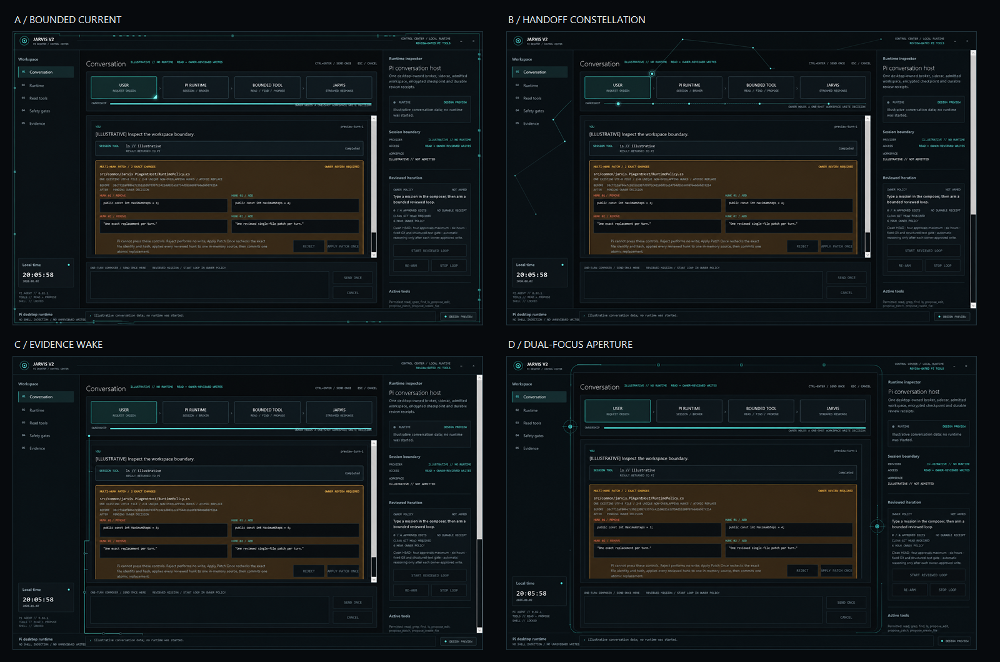
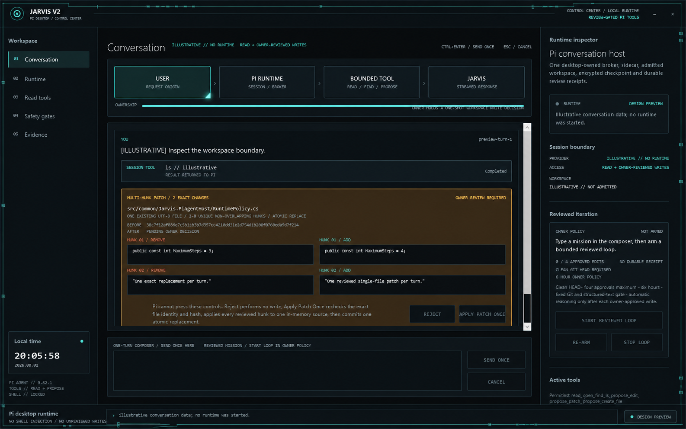
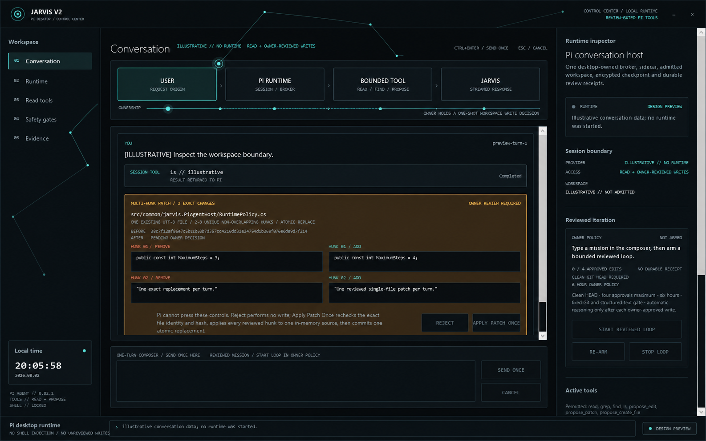
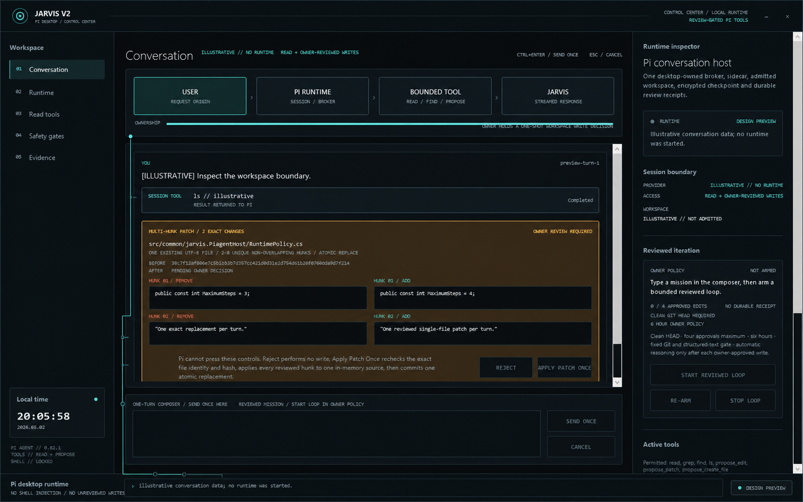
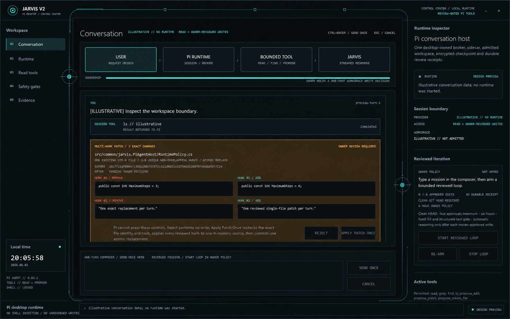

# Neural Void global VFX proposals

- Date: 2026-08-03
- Surface: `Jarvis.ControlCenter` owned WPF window
- Mode: Operate
- Source frame: `docs/screenshots/jarvis-control-center-reviewed-multi-hunk-patch.png`
- Review state: **IMPLEMENTED / TRIANGLE GLOW FINISH REVIEW PASS**
- Product implementation: **B + A TRIANGLE + BOUNDED GLOW + NEURAL SCROLLBAR**

## Owner decision

On 2026-08-03 the owner selected a deliberate hybrid:

- use **B / Handoff Constellation** as the global composition;
- retain A's bright lower-right focus as a small vector triangle on the active
  `USER` stage, and let it follow the current owner across all four handoff
  stages;
- replace the default white WPF scrollbar chrome with a narrow Neural Void
  track and graphite thumb that uses shared cyan only on hover or drag.
- process only the triangle and matching rail signal through one bounded
  Gaussian glow pass, while rendering the crisp vector source above it.

This is the complete visible authorization for the first Control Center slice.
It does not select A's perimeter current, C's evidence wake, D's aperture frame,
particles, custom shaders, multi-pass bloom or another post-process.

## Reviewed proposals

| Proposal | Product idea | Focal moment | Static evidence |
| --- | --- | --- | --- |
| A / Bounded Current | The application is one visibly bounded capability. | One signal packet moves clockwise around the owned-window perimeter and aligns with the active handoff stage. | `proposal-a-bounded-current.png` |
| B / Handoff Constellation | Jarvis is the path by which control changes hands. | A sparse point-and-line route advances through `USER -> PI RUNTIME -> BOUNDED TOOL -> JARVIS`. | `proposal-b-handoff-constellation.png` |
| C / Evidence Wake | Completed work leaves a short, deterministic trace rather than decorative activity. | A signal descends beside the transcript and resolves into progressively shorter evidence echoes at the runtime rail. | `proposal-c-evidence-wake.png` |
| D / Dual-Focus Aperture | The complete work plane is one owned computational body with a defined ingress and review egress. | Two focus junctions energize an incomplete aperture contour around the central work plane. | `proposal-d-dual-focus-aperture.png` |

The four images are review assets, not application textures. A selected direction
must be rebuilt as retained mathematical geometry in WPF; no generated bitmap is
shipped or drawn by the product.

Image generation can perturb tiny rasterized glyphs in the mockups. The source
frame and WPF source remain the authority for copy, geometry and interaction;
this review compares only the added global effect composition.

## Shared product invariants

Every proposal preserves the incumbent Control Center hierarchy and interaction
contract:

- the transcript and owner-review plane remain dominant and unobstructed;
- the effect layer is owned by the ordinary Control Center process, clipped to
  that window, below interactive content and excluded from hit testing;
- one shared visual signal drives `accent`, `active` and `pulse`; warning and
  fault remain isolated safety channels;
- no control, card or button owns a glow, particle emitter or local fixed color;
- no bitmap, desktop wallpaper, decorative device, Shell surface, process
  injection, registry write or physical-device I/O is introduced;
- text, keyboard focus, automation names and state labels carry the complete
  meaning when the visual layer is absent;
- the product geometry uses retained points, lines, polylines, paths, arcs,
  rectangles and ellipses. The only enabled post-process is the independently
  reviewed bounded triangle/rail glow; particles and every other stage remain
  disabled.

## Runtime state mapping

The selected geometry changes behavior, not meaning. The same state mapping
applies to all four proposals.

| Desktop state | Visual behavior |
| --- | --- |
| `NotStarted`, `Preview`, `Stopped` | Static neutral structure; no periodic animation. |
| `Starting`, `Stopping` | Motion pauses at the current boundary. Existing amber state treatment remains the source of truth. |
| `Ready`, no active turn | Low-intensity shared accent at a stable phase; no continuous attention pulse. |
| Active turn | One bounded pulse advances with `HandoffProgress`; only the current owner is emphasized. |
| Owner review pending | Motion stops at the owner-review egress. Existing amber review UI remains authoritative. |
| `Faulted` | Nonessential animation stops. Existing coral fault UI remains authoritative; RGB cannot recolor the fault. |

## Accessibility and degradation contract

The implementation following selection must fail quiet:

1. When the window is hidden or minimized, frame callbacks are detached.
2. When Windows high contrast is active, the optional effect layer is absent.
3. When client-area animation is disabled, only the stable retained geometry is
   drawn; phase and pulses do not advance.
4. On WPF rendering tier 0 or after a missed frame-time budget, the renderer
   selects a static low-power scene before removing core UI or state text.
5. Resize, DPI and display changes rebuild a frozen retained scene; they do not
   stretch a bitmap or start an unbounded allocation loop.
6. Closing the window detaches every timer or rendering callback before the
   desktop runtime completes orderly shutdown.

## Initial engineering budget

This proposal gate deliberately stays far below the existing `low-power`
retained-scene ceiling. The selected first slice is admitted only when it can be
expressed with:

- at most 96 retained vector commands;
- at most 24 per-frame commands;
- zero particles or trail buffers and exactly one bounded glow post-process;
- the existing deterministic 60 Hz signal clock, with rendering sampled no
  faster than the profiled owned-window budget;
- no allocation of brushes, pens or geometry on the steady-state frame path;
- deterministic capture output for a fixed phase and window size.

The implemented layer keeps the deterministic signal contract at 60 Hz and
samples 30 prebuilt frozen drawings per second. The timer runs only for an active
ready turn. The Gaussian pass is confined to a maximum 139 by 66 pixel envelope
at the reference layout; hidden, minimized, reduced-motion, rendering-tier-zero
and fault states remove it and retain or remove the crisp vector core according
to the existing state contract.

## Proposal notes

### A / Bounded Current

Strongest expression of safety and scope. It makes the one-window boundary
legible even when the transcript is visually dense. Its main risk is competing
with native resize chrome; implementation must keep the outermost pixels quiet
and place current segments inside the content frame.

### B / Handoff Constellation

Strongest expression of ownership transfer. It maps directly to the existing
four-stage handoff model and needs the fewest new concepts. Its main risk is
turning into a decorative network; the implementation budget therefore fixes a
small node count and permits only one active pulse.

### C / Evidence Wake

Strongest expression of durable work and auditability. It keeps the top-level
handoff rail visually simple and lets recent activity decay into the status
rail. Its main risk is implying that transient VFX is durable evidence; the
receipt text remains authoritative and every wake disappears after a bounded
interval.

### D / Dual-Focus Aperture

Strongest expression of an embodied Jarvis identity and the closest continuation
of the approved `aperture-contour-v1` language. The two focus junctions make
ingress and owner-review egress explicit. Its main risk is excessive framing;
the compound contour must remain incomplete and subordinate to the transcript.

## Selected implementation boundary

The owner selection authorizes only the B constellation, travelling triangular
active-stage focus, its one bounded Gaussian glow pass and the scrollbar restyle
in the owned Control Center window. It does not authorize particles, custom
shaders, multi-pass post-processing, Shell rendering, Explorer mutation, a
physical RGB adapter or a live module.

## Finish review

The bounded owned-window review is **PASS**:

- actual WPF evidence at 1440 x 900:
  `docs/screenshots/jarvis-control-center-triangle-glow.png`;
- compact 1180 x 760 evidence:
  `docs/screenshots/jarvis-control-center-triangle-glow-compact.png`;
- 23 retained static commands and five commands in each prebuilt dynamic frame,
  below the reviewed 96 / 24 caps;
- one radius-8 WPF blur pass over a maximum 139 by 66 pixel active-signal
  envelope, with the crisp triangle rendered above it and no bitmap asset;
- the native scrollbar `Track`, paging commands and draggable thumb are retained
  for both orientations; high contrast switches it to system colors;
- the executable triangular VFX probe passes every stage/frame case and the
  shared RGB model audit passes all 19 checks; the complete Control Center audit
  remains subject to the repository's clean-runner publication gate;
- publication boundary and cross-platform layout audits pass;
- activation remains false, live Explorer validation remains `not-run`, and no
  mutation was performed.

The evidence is an ordinary Control Center process capture. No Pi runtime,
Shell surface, device adapter or live module was started to produce it.
